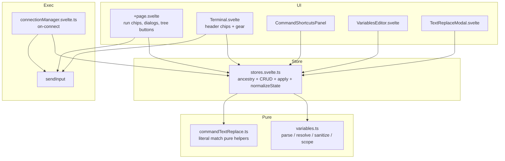
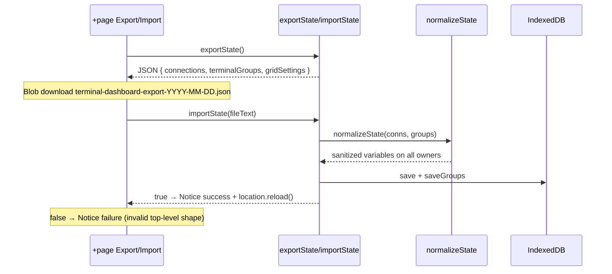
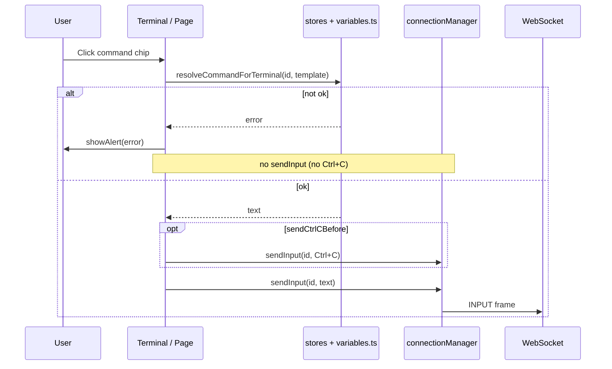
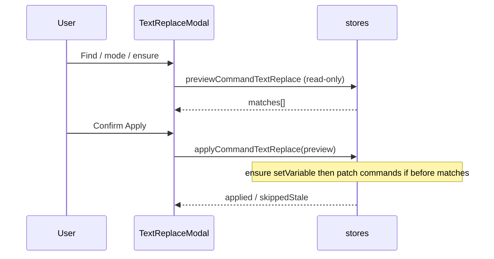
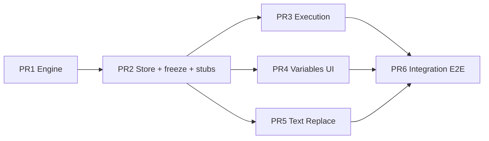

# Hierarchical Variables & Text Replacement for Terminal Dashboard

| Field | Value |
|-------|--------|
| **Author** | Terminal Dashboard maintainers |
| **Date** | 2026-08-02 |
| **Status** | Draft (revised after design review) |
| **Stack** | Svelte 5 + SvelteKit, TypeScript, IndexedDB, Playwright |
| **Primary code** | `src/lib/stores.svelte.ts`, `src/lib/connectionManager.svelte.ts`, `src/lib/db.ts`, `src/routes/+page.svelte`, `src/lib/components/Terminal.svelte`, `src/lib/components/CommandShortcutsPanel.svelte` |

---

## Overview

Terminal Dashboard stores command strings on terminals (`SavedCommand.command`) and sends them raw via `sendInput` from both UI run paths and on-connect hooks. Teams often repeat hostnames, paths, env names, and service identifiers across many shortcuts; a single rename today requires editing every command by hand.

This design introduces **hierarchical key–value variables** on connections, project groups, projects, terminals, and terminal groups. Variables resolve **down the tree** (ancestors first; closer definitions override farther ones). Command text may reference variables with `${name}` syntax. Resolution is **fail-closed**: unresolved or malformed references block send and surface a user-visible error. A companion **text replacement** feature bulk-rewrites command instruction strings (plain text → text, or text → variable reference) across a selected subtree or terminal group.

A pure TypeScript resolution engine (`src/lib/variables.ts`) and pure text-replace helpers (`src/lib/commandTextReplace.ts`) keep logic testable without the Svelte runtime. Store APIs, execution paths, UI editors, migration, and Playwright coverage extend existing patterns in `tests/*.spec.ts`.

---

## Background & Motivation

### Current state

Hierarchy (from `src/lib/stores.svelte.ts`; file header still says `Connection → Project → Terminal` only — the fuller tree below is what the code actually supports):

```
Connection
  ├── projects: Project[]
  │     └── terminals: TerminalTab[]
  │           └── savedCommands: SavedCommand[]
  └── projectGroups?: ProjectGroup[]
        └── projects: Project[]
              └── terminals: TerminalTab[]
                    └── savedCommands: SavedCommand[]

TerminalGroup (flat, parallel)
  └── terminalIds: string[]   // cross-tree references by id
```

**Data-model fact:** a project lives in **at most one** place — either `conn.projects` or exactly one `ProjectGroup.projects` array (enforced by `moveProject` / `addProject`). Terminal groups are many-to-many via `terminalIds`.

Relevant types today:

```6:56:src/lib/stores.svelte.ts
export interface SavedCommand {
  id: string;
  label: string;
  command: string;
  isOnConnect: boolean;
  autoExecute?: boolean;
  sendCtrlCBefore?: boolean;
}
// TerminalTab, Project, ProjectGroup, Connection, TerminalGroup — no variables field
```

Command execution paths (all send **raw** `cmd.command`):

| Path | Location | Behavior |
|------|----------|----------|
| Sidebar chip click | `+page.svelte` → `handleRunCommand` | `sendInput(terminalId, command [+ '\n'])` |
| Terminal header chips | `Terminal.svelte` → `runCommand` | same |
| Gear panel run | `CommandShortcutsPanel` → `onRun` → `runCommand` | same |
| On-connect | `connectionManager.svelte.ts` `ws.onopen` (~123–140) | `getOnConnectCommands(terminalId)` then `sendInput(cmd + '\n')` |

Persistence: IndexedDB `terminal-dashboard` v1, object store `state`, keys `connections`, `terminal_groups`, `grid_settings` (`src/lib/db.ts`). Export/import via `exportState` / `importState` (JSON snapshot of connections + groups + grid).

### Pain points

1. **Duplicated literals** across terminals in the same project (paths, cluster names, compose files).
2. **No inheritance**: renaming an environment requires multi-terminal edits.
3. **Cross-cutting groups** (`TerminalGroup`) organize terminals but cannot share command configuration.
4. **No safe bulk rewrite** when migrating from hard-coded strings to parameterized commands.

### Constraints from existing code

- `findTerminalById` returns `{ conn, project, terminal }` but **not** the enclosing `ProjectGroup`. **`findProjectById` already returns `{ conn, group, project }`** — ancestry implementation should reuse that pattern for projects and extend terminal lookup similarly.
- `getOnConnectCommands` returns bare `string[]` with no error channel — on-connect needs a dual API (resolved strings + separate errors). See locked contract below.
- Load path migrates terminals via `migrateTerminal` only; `terminalGroups = groupData` has no per-node normalize today — variables require a full-tree `normalizeState`.
- Tests primarily use `page.evaluate(async () => import('/src/lib/…'))` store-level checks plus selective UI flows (`tests/session-features-regression.spec.ts`, `tests/feature-tooltips-and-duplication.spec.ts`).
- `+page.svelte` is large (~1647 lines) and owns dialogs (`showPrompt`, `showConfirm`, `showAlert`, `showCommandPrompt`). New multi-field UIs must be **components**. Sidebar uses **icon buttons + `data-tooltip`**, not context menus.

---

## Goals & Non-Goals

### Goals

1. Nodes that own variables: **Connection**, **ProjectGroup**, **Project**, **TerminalTab**, **TerminalGroup**.
2. Tree resolution with **child overrides parent** for the same key; **context variables** always present in the scope map for a terminal execution context (display names space→`_` on inject).
3. **Scope enforcement**: a reference resolves only if defined on the node or an ancestor (plus context vars + applicable terminal-group vars). Out of scope, **malformed**, or **unclosed** tokens → **fail closed**.
4. **All command instruction send paths** resolve **before any** `sendInput` (including Ctrl+C). Tooltips show the **stored template** (K13).
5. **Text replacement** over `SavedCommand.command` only: find → replace text, or find → `${varName}` when the variable is/will be in scope.
6. **Backward compatible**: existing data without `variables` loads unchanged; plain commands without `${…}` behave as today.
7. **Thorough Playwright coverage** matching existing store-evaluate + UI patterns; split test files per layer.
8. **Multi-agent PR plan** with frozen store signatures in PR2, pure modules for engine/replace, and clear file ownership.
9. **Import/export portability** for all node variables and command templates (store contract + UI download/`setInputFiles` E2Es).

### Non-Goals

- Shell/env expansion on the remote host (this is **client-side** substitution only).
- Unlimited nested expansion — multi-pass with hard cap only (K7).
- Variables on individual `SavedCommand` objects.
- Secret vaults, encryption at rest, or remote sync.
- Changing IndexedDB schema version; optional fields on existing JSON blobs only.
- Full templating language (conditionals, loops, filters, `${name:-default}` defaults — deferred A8).
- **No `terminalGroup.*` context variables** in v1 (ambiguous when a terminal is in multiple groups).
- **No raw-with-spaces twin keys** for context names in v1 (only slugified inject); UI still displays real names with spaces.
- Variables in command **labels** (K16).
- Regex mode for text replace (K17).
- Dynamic key names composed from other variables (e.g. resolving a key named `${prefix}_host` as a single lookup — not supported).

---

## Key Decisions

| # | Decision | Rationale |
|---|----------|-----------|
| K1 | **Syntax: `${name}`** with dotted **context** keys (`${terminal.name}`) and bare user keys (`${env}`) | Familiar, unambiguous boundary; avoids bare `$name` colliding with pasted shell fragments. |
| K2 | **Escape: `$${` → literal `${`** (only that form); unpaired `$` left as-is | Minimal escaping for the rare literal `${` need. |
| K3 | **User variable names: `^[A-Za-z_][A-Za-z0-9_]*$`** | Simple identifiers; dotted names are context-only. |
| K4 | **Fail closed** on unresolved **or malformed** references for interactive run: block **all** sends including Ctrl+C + `showAlert`. On-connect: **partial success** — run successfully resolved commands; skip failures; **must** record errors in `lastOnConnectErrors` and expose a **tree-row `data-tooltip`** when non-empty (not console-only). | Safer than leave-as-is; on-connect must not kill the whole connection. |
| K5 | **Override order (lowest → highest priority):** Connection → ProjectGroup (if any) → Project → TerminalGroup(s) in `terminalGroups` array order → Terminal → **Context** map | Closer overrides farther. Context keys are **dotted** and never collide with bare user keys (see K5a). Context applied last is defense-in-depth if a bad map ever contains a dotted key. |
| K5a | **Bare user keys may equal context prefixes** (`terminal`, `project`, `projectGroup`, `connection`) | `${terminal}` ≠ `${terminal.name}` in a flat map. Do **not** reserve those four bare names. V19 rejects only dotted user keys / invalid chars, not bare `terminal`. |
| K6 | **Terminal groups:** merge vars from **all** groups containing the terminal, in global `terminalGroups` array order; **later overrides earlier**; terminal node vars still override groups | Deterministic multi-group merge. |
| K7 | **Multi-pass expansion:** each pass fully rescans the **current output string**. Variable **values are templates** (re-parsed on subsequent passes). `maxPasses = 3`. **No dynamic key names.** Distinct errors: missing keys vs depth exhausted. Embed literal `${` in a value with `$${`. | Supports values that reference other keys; prevents infinite loops; documents shell-`${` footgun (escape in values). |
| K8 | **Pure modules:** `src/lib/variables.ts` (parse/resolve/sanitize/scope merge) + `src/lib/commandTextReplace.ts` (preview match pure logic). **Structural types only** in pure modules — no import from `stores.svelte.ts`. | Avoids cycles; multi-agent friendly. |
| K9 | **Storage: `variables?: NodeVariables`** on each owning node | Trivial migration; export/import free. |
| K10 | **Text replace:** pure preview (no writes); apply re-reads live commands, commits ensure + updates **atomically**, skips stale `before` mismatches. Empty `find` rejected. Case-sensitive literal split. `toVariable` builds `` `${variableKey}` `` from `variableKey` only. | No preview/apply lifecycle ambiguity; no empty-find data loss. |
| K11 | **No DB version bump**; `normalizeState(conns, groups)` single walk for load + import | One code path; covers TerminalGroup. |
| K12 | **`findTerminalAncestry`** returns full chain including `ProjectGroup \| null` and matching `TerminalGroup[]`; `findTerminalById` stays additive (implemented via ancestry). Reuse `findProjectById`’s group return pattern. | Required for resolution. |
| K13 | **Tooltips show stored template** always. Optional “Test resolve” in gear panel only (not chip tooltip). | Predictable UI; avoid noisy failures in hover. |
| K14 | **Multi-group source badges** in VariablesEditor effective list when terminal context is known (`source: 'connection' \| … \| 'terminalGroup:<id>'`). | Debuggability for K6. |
| K15 | **On-connect contract (locked):** Internal `collectOnConnectResolution(terminalId)` returns `{ commands, errors }` in **one** resolve walk. Public wrappers: `getOnConnectCommands(id): string[]` = successes only (partial); `getOnConnectResolutionErrors(id)` = failures. Never gate on “all succeed.” `connectionManager` sends the string[] and writes errors into `lastOnConnectErrors`. | Single walk avoids dual-loop drift; matches string[] call site with explicit error channel. |
| K16 | **No variables in labels** in v1. | Scope control. |
| K17 | **Literal text replace only** (no regex) in v1. | Safety and simplicity. |
| K18 | **`renameVariableKey`:** renames the key **only** (no automatic template rewrite). UI shows reference count via `extractReferencedKeys` over scope commands and links to Text Replace for `${old}` → `${new}`. | Consistent with no-rewrite-on-move; avoids half-built auto-migrate. |
| K19 | **Strict token scan (fail closed):** any `${` that is not the escape `$${` and not a complete valid `${key}` (including unclosed `${…`) is a **hard error** (`errorKind: 'malformed'`). | Aligns parser with K4; closes `${bad-name}` leave-as-is hole. |
| K20 | **Context variables** (formerly “system variables” — product name: **Context variables**; keys still `terminal.*` / `project.*` / …). Always present for a terminal execution context (values may be `""`). Never “unresolved” by absence. No `terminalGroup.*` context vars. | Completeness; multi-group ambiguity avoided; clearer UI name than “system.” |
| K20a | **Name slugification for command injection:** when building the context map, **display-name fields** (`terminal.name`, `project.name`, `projectGroup.name`, `connection.name`) replace each ASCII space ` ` with `_` before injection. Stored UI names keep spaces; only resolved command text sees underscores. IDs, `workingDir`, `tmuxSession`, `wsUrl` are **not** slugified. | Shell-friendly tokens when names contain spaces (e.g. `My Terminal` → `My_Terminal`). |
| K21 | **Central `sanitizeVariables(unknown): NodeVariables`** used by load, import, and `setVariable`. | Prototype pollution + type safety. |
| K22 | **Expand-at-run** (not expand-at-save). Changing a variable updates all usages without rewriting stored templates. | Core product goal. |
| K23 | **Preview UI cap:** show first **100** matches + total count; apply processes **all** entries in the in-memory `preview.matches` array only (no full scope re-scan on apply; stale rows skipped via `before` re-read). | UX for large dashboards; matches K10 lifecycle. |
| K24 | **PR2 freezes** full TypeScript signatures for CRUD, ancestry, resolve wrappers, on-connect dual API, **and stub** `previewCommandTextReplace` / `applyCommandTextReplace` (throw or empty until PR5 implements via `commandTextReplace.ts`). | Multi-agent merge safety. |
| K25 | **Import/export is a first-class portability path for variables.** `exportState` snapshot includes `variables` on all five owner kinds (via existing connections + terminalGroups JSON). `importState` always runs `normalizeState` / `sanitizeVariables`. Round-trip and UI E2Es are required (see Testing Strategy V26–V28, U11a–U11h) — not a single smoke test. | Variables must travel with dashboard backups; soft-normalize must not drop valid maps. |

---

## Proposed Design

### Architecture



**Dependency rule:** `variables.ts` and `commandTextReplace.ts` must **not** import `stores.svelte.ts`. Stores import pure modules and assemble layers from live state.

### Data model

```typescript
/** User-defined variables on a hierarchy node. Keys: ^[A-Za-z_][A-Za-z0-9_]*$ after sanitize */
export type NodeVariables = Record<string, string>;

// SavedCommand unchanged

export interface TerminalTab {
  id: string;
  name: string;
  tmuxSession: string;
  workingDir: string;
  fontSize: number;
  savedCommands: SavedCommand[];
  collapsed: boolean;
  gridHidden?: boolean;
  pinned?: boolean;
  variables?: NodeVariables; // NEW
}

export interface Project {
  id: string;
  name: string;
  terminals: TerminalTab[];
  collapsed: boolean;
  variables?: NodeVariables; // NEW
}

export interface ProjectGroup {
  id: string;
  name: string;
  projects: Project[];
  collapsed: boolean;
  variables?: NodeVariables; // NEW
}

export interface Connection {
  id: string;
  name: string;
  wsUrl: string;
  projects: Project[];
  projectGroups?: ProjectGroup[];
  collapsed: boolean;
  variables?: NodeVariables; // NEW
}

export interface TerminalGroup {
  id: string;
  name: string;
  terminalIds: string[];
  collapsed: boolean;
  variables?: NodeVariables; // NEW
}
```

### Normalization & sanitization

#### `sanitizeVariables` (in `variables.ts`)

```typescript
const DANGEROUS_KEYS = new Set(['__proto__', 'prototype', 'constructor']);

export function isValidUserKey(key: string): boolean {
  return /^[A-Za-z_][A-Za-z0-9_]*$/.test(key);
}

/**
 * Coerce unknown JSON into a safe NodeVariables map.
 * - Non-objects (null, array, string, number) → {}
 * - Drop keys that fail isValidUserKey OR are in DANGEROUS_KEYS
 * - Coerce values with String(v) only if typeof v === 'string'; else drop entry
 * - Never assign via prototype-polluting paths: build a new Object.create(null) or plain {}
 *   using only sanitized keys (Object.defineProperty or simple {} + assignment after key check)
 */
export function sanitizeVariables(input: unknown): NodeVariables {
  if (!input || typeof input !== 'object' || Array.isArray(input)) return {};
  const out: NodeVariables = {};
  for (const [k, v] of Object.entries(input as Record<string, unknown>)) {
    if (DANGEROUS_KEYS.has(k)) continue;
    if (!isValidUserKey(k)) continue;
    if (typeof v !== 'string') continue;
    out[k] = v;
  }
  return out;
}
```

`setVariable` **must** call `isValidUserKey` + reject dangerous keys (same set) before write — not only import/load.

#### `normalizeState` (in `stores.svelte.ts`)

Single function used by **initial load** and **`importState`**:

```typescript
export function normalizeState(
  conns: Connection[],
  groups: TerminalGroup[]
): { connections: Connection[]; terminalGroups: TerminalGroup[] } {
  for (const conn of conns) {
    conn.variables = sanitizeVariables(conn.variables);
    conn.projects = conn.projects || [];
    conn.projectGroups = conn.projectGroups || [];
    for (const proj of conn.projects) normalizeProject(proj);
    for (const pg of conn.projectGroups) {
      pg.variables = sanitizeVariables(pg.variables);
      pg.projects = pg.projects || [];
      for (const proj of pg.projects) normalizeProject(proj);
    }
  }
  for (const g of groups) {
    g.variables = sanitizeVariables(g.variables);
    g.terminalIds = Array.isArray(g.terminalIds) ? g.terminalIds : [];
  }
  return { connections: conns, terminalGroups: groups };
}

function normalizeProject(proj: Project) {
  proj.variables = sanitizeVariables(proj.variables);
  proj.terminals = (proj.terminals || []).map((t) => {
    const mt = migrateTerminal(t); // existing startupCommand migration
    mt.variables = sanitizeVariables(mt.variables);
    return mt;
  });
}
```

**Import behavior:** invalid `variables` shapes **do not abort** the whole import — they soft-normalize to `{}` / stripped maps. Existing strict checks on `id`/`name`/array shapes remain.

### Variable syntax

| Form | Meaning |
|------|---------|
| `${env}` | Lookup user/merged key `env` |
| `${terminal.name}` | **Context variable** (display name, spaces → `_` on inject) |
| `$${anything` or `$${foo}` | After escape consumption: literal `${` then remainder scanned (`$${foo}` → `${foo}` as literal text if `foo}` is not re-scanned as token — see escape rule below) |
| `$env` / `{{env}}` | Not variable syntax; left unchanged |
| `${bad-name}`, `${}`, `${1abc}`, `${foo-bar}` | **Malformed** → fail closed |
| `${unterminated` or trailing `${` | **Malformed** (unclosed) → fail closed |

**Escape rule (precise):** When the scanner is at index `i` on character `$`:
1. If the next three characters are `$${` (i.e. `template.slice(i, i + 3) === '$${'`), emit literal `${` and advance by **3**.
2. Else if the next character is `{`, parse a **strict** key: full match starting at `{` of `\{([A-Za-z_][A-Za-z0-9_]*(?:\.[A-Za-z_][A-Za-z0-9_]*)*)\}`. If the `{…}` does not fully match (invalid chars, empty, or no closing `}` before end), return **malformed** error spanning from that `${`.
3. Else emit `$` as literal and advance by 1.

**Do not** use a regex that only matches valid tokens and silently leaves invalid `${…}` in the string.

### Context variables

**Product name: Context variables** (UI labels, docs, tooltips). Avoid “system variables” in user-facing copy. Code identifiers may use `Context` / `buildContextVars` (alias `buildSystemVars` only if migrating mid-PR — prefer `buildContextVars` from day one).

Injected for **terminal execution context** only. Always present in the scope map (K20). **Not** stored in node `variables` maps — they are derived at resolve time from live tree names/ids. Export/import therefore does **not** embed context values; after import, context keys recompute from restored node names.

| Key | Source | Inject transform | Presence (K20) |
|-----|--------|------------------|----------------|
| `terminal.name` | `TerminalTab.name` | **spaces → `_`** (K20a) | Always; may be `""` |
| `terminal.id` | `TerminalTab.id` | none | Always |
| `terminal.tmuxSession` | `TerminalTab.tmuxSession` | none | Always; may be `""` |
| `terminal.workingDir` | `TerminalTab.workingDir` | none (paths may need spaces) | Always; may be `""` |
| `project.name` | `Project.name` (folder) | **spaces → `_`** | Always; may be `""` |
| `project.id` | `Project.id` | none | Always |
| `projectGroup.name` | `ProjectGroup.name` or `""` | **spaces → `_`** when non-empty | Always; `""` if ungrouped |
| `projectGroup.id` | id or `""` | none | Always; `""` if ungrouped |
| `connection.name` | `Connection.name` | **spaces → `_`** | Always; may be `""` |
| `connection.id` | `Connection.id` | none | Always |
| `connection.wsUrl` | `Connection.wsUrl` | none | Always; may be `""` |

**Name slugify rule (K20a):** `slugifyNameForCommand(s: string) => s.replaceAll(' ', '_')` — each ASCII space becomes underscore; no other character folding in v1 (tabs/newlines in names are rare; if present, leave as-is unless implementers choose to expand to `/\s/g` — **v1 lock: ASCII space only**).

Example: terminal named `API East` → `${terminal.name}` resolves to `API_East` in the command string. Sidebar still shows `API East`.

All context keys are **always present** for a terminal execution context; empty string is a successful resolution target, never “unresolved by absence.”

**Non-goal:** `terminalGroup.name` / `terminalGroup.id` — multi-group ambiguity.

### Structural types in `variables.ts` (no store import)

```typescript
export type NodeVariables = Record<string, string>;

/** Replace each ASCII space with `_` for command-safe display names (K20a). */
export function slugifyNameForCommand(name: string): string {
  return name.replaceAll(' ', '_');
}

/** Fields required to build context vars — structural, not store classes */
export interface ContextSource {
  terminalName: string;
  terminalId: string;
  tmuxSession: string;
  workingDir: string;
  projectName: string;
  projectId: string;
  projectGroupName: string; // "" if none
  projectGroupId: string;   // "" if none
  connectionName: string;
  connectionId: string;
  connectionWsUrl: string;
}

/** @deprecated name — use ContextSource */
export type SystemContext = ContextSource;

export function buildContextVars(ctx: ContextSource): Record<string, string> {
  return {
    'terminal.name': slugifyNameForCommand(ctx.terminalName),
    'terminal.id': ctx.terminalId,
    'terminal.tmuxSession': ctx.tmuxSession,
    'terminal.workingDir': ctx.workingDir,
    'project.name': slugifyNameForCommand(ctx.projectName),
    'project.id': ctx.projectId,
    'projectGroup.name': slugifyNameForCommand(ctx.projectGroupName),
    'projectGroup.id': ctx.projectGroupId,
    'connection.name': slugifyNameForCommand(ctx.connectionName),
    'connection.id': ctx.connectionId,
    'connection.wsUrl': ctx.connectionWsUrl,
  };
}

/** Merge user layers low→high priority, then context (highest). */
export function buildScopeMap(
  layers: NodeVariables[],
  context: Record<string, string>
): Map<string, string> {
  const map = new Map<string, string>();
  for (const layer of layers) {
    for (const [k, v] of Object.entries(layer)) {
      if (isValidUserKey(k)) map.set(k, v);
    }
  }
  for (const [k, v] of Object.entries(context)) {
    map.set(k, v);
  }
  return map;
}
```

### Ancestry (stores only)

```typescript
export interface TerminalAncestry {
  conn: Connection;
  projectGroup: ProjectGroup | null;
  project: Project;
  terminal: TerminalTab;
  /** Groups that list this terminal, in global terminalGroups order */
  terminalGroups: TerminalGroup[];
}

export function findTerminalAncestry(terminalId: string): TerminalAncestry | null {
  // Walk like findTerminalById, but retain ProjectGroup when found under projectGroups
  // (mirror findProjectById which already returns group).
  // terminalGroups: getTerminalGroups().filter(g => g.terminalIds.includes(terminalId))
  // preserving array order.
}

export function findTerminalById(terminalId: string) {
  const a = findTerminalAncestry(terminalId);
  return a ? { conn: a.conn, project: a.project, terminal: a.terminal } : null;
}

export function ancestryToContextSource(a: TerminalAncestry): ContextSource {
  return {
    terminalName: a.terminal.name,
    terminalId: a.terminal.id,
    tmuxSession: a.terminal.tmuxSession,
    workingDir: a.terminal.workingDir || '',
    projectName: a.project.name,
    projectId: a.project.id,
    projectGroupName: a.projectGroup?.name ?? '',
    projectGroupId: a.projectGroup?.id ?? '',
    connectionName: a.conn.name,
    connectionId: a.conn.id,
    connectionWsUrl: a.conn.wsUrl,
  };
}

export function ancestryToLayers(a: TerminalAncestry): NodeVariables[] {
  const layers: NodeVariables[] = [a.conn.variables ?? {}];
  if (a.projectGroup) layers.push(a.projectGroup.variables ?? {});
  layers.push(a.project.variables ?? {});
  for (const g of a.terminalGroups) layers.push(g.variables ?? {});
  layers.push(a.terminal.variables ?? {});
  return layers;
}
```

### Resolve algorithm (`resolveTemplate`)

```typescript
export type ResolveErrorKind = 'unresolved' | 'malformed' | 'max_passes';

export type ResolveResult =
  | { ok: true; text: string; usedKeys: string[] }
  | {
      ok: false;
      error: string;           // human-readable, stable prefixes for tests
      errorKind: ResolveErrorKind;
      unresolved: string[];    // missing keys (empty if malformed/max_passes only)
      malformed?: string;      // snippet or description
    };

export function resolveTemplate(
  template: string,
  scope: Map<string, string>,
  opts?: { maxPasses?: number } // default 3
): ResolveResult;
```

**Per pass:**

1. Scan left-to-right with the strict rules above.
2. On malformed/unclosed → **immediate** `{ ok: false, errorKind: 'malformed', error: 'Malformed variable token: …', unresolved: [] }`.
3. On valid `${key}`: if `!scope.has(key)` → record key in `missing` set; still finish the pass collecting all missing (or fail fast — **v1: collect all missing in the pass, then fail**).
4. If `missing.size > 0` after the pass → `{ ok: false, errorKind: 'unresolved', error: 'Unresolved variable(s): a, b', unresolved: [...] }`.
5. If no missing and a full rescan of the output finds **no** strict tokens (no valid `${key}` and no malformed `${` candidate that would error) → `{ ok: true, text, usedKeys }`.
6. If no missing, but the output still contains a token candidate that a further pass could process (valid `${key}` remaining after substitution introduced new references), **and** `pass < maxPasses`, run another pass on the **output** (values are templates). Do **not** schedule an extra pass merely because substitutions occurred when no `${` candidates remain.
7. If after `maxPasses` the result still has valid `${…}` tokens or unresolved keys → `{ ok: false, errorKind: 'max_passes', error: 'Variable expansion exceeded max passes (3)', unresolved: [...] }`.
8. Malformed tokens fail in the pass where they are detected (step 2), not deferred to max_passes.

**Notes:**

- Empty string values **are** in scope (`scope.has` true) → resolve to `""`.
- **No dynamic keys:** key text is fixed inside `${…}` before lookup; `${prefix}` with value `prod` yields `prod` + following literal `_host` for template `${prefix}_host` — that is **not** a lookup of key `prod_host`.
- To put a literal `${` in a **value**, store `$${` in the value string (same escape).

**Stable error strings (for tests):**

| Kind | Prefix |
|------|--------|
| unresolved | `Unresolved variable(s): ` |
| malformed | `Malformed variable token: ` |
| max_passes | `Variable expansion exceeded max passes` |

### Variable CRUD — frozen signatures

```typescript
export type VariableOwnerKind =
  | 'connection'
  | 'projectGroup'
  | 'project'
  | 'terminal'
  | 'terminalGroup';

/** Discriminated ids — every kind has an exact required shape */
export type VariableOwnerRef =
  | { kind: 'connection'; connectionId: string }
  | { kind: 'projectGroup'; connectionId: string; projectGroupId: string }
  | { kind: 'project'; projectId: string } // resolve via findProjectById
  | { kind: 'terminal'; terminalId: string }
  | { kind: 'terminalGroup'; terminalGroupId: string };

export interface VariableSourceEntry {
  key: string;
  value: string;
  source:
    | { kind: 'connection'; id: string; name: string }
    | { kind: 'projectGroup'; id: string; name: string }
    | { kind: 'project'; id: string; name: string }
    | { kind: 'terminalGroup'; id: string; name: string }
    | { kind: 'terminal'; id: string; name: string }
    | { kind: 'system' };
}

export function getOwnVariables(ref: VariableOwnerRef): NodeVariables;

/** Own vars only for any owner. */
export function setVariable(
  ref: VariableOwnerRef,
  key: string,
  value: string
): { ok: true } | { ok: false; error: string };

export function removeVariable(ref: VariableOwnerRef, key: string): void;

/**
 * Rename key on the owner only. Does NOT rewrite command templates (K18).
 * Returns referenceCount = number of SavedCommand.command strings in the
 * owner's rewrite scope that contain `${oldKey}` as a well-formed token.
 */
export function renameVariableKey(
  ref: VariableOwnerRef,
  oldKey: string,
  newKey: string
): { ok: true; referenceCount: number } | { ok: false; error: string };

/**
 * Ancestor layers only — **never includes own variables, never includes system**.
 * Used for the read-only “Inherited” section next to the editable Own table.
 * - connection: []  (no parents)
 * - projectGroup: connection layer entries only
 * - project: connection + optional projectGroup (not own project vars)
 * - terminal: connection + optional projectGroup + project + terminalGroups
 *             (not own terminal vars, not system)
 * - terminalGroup: []  (no tree parents; UI uses helper text for member merge semantics)
 *
 * For terminal editors that need own + system with source badges (K14), use
 * `getEffectiveVariableEntries(terminalId)` instead — do not overload “inherited”
 * to mean “effective.”
 */
export function getInheritedVariableEntries(ref: VariableOwnerRef): VariableSourceEntry[];

/**
 * Full effective breakdown for a terminal: all user layers (incl. own) + system,
 * each entry tagged with `source` (and implicitly last-writer wins for display of
 * final values — UI may show winning value per key with source badge).
 */
export function getEffectiveVariableEntries(terminalId: string): VariableSourceEntry[];

/** Full effective map for a terminal (user layers + system). Primary run-path helper. */
export function getEffectiveVariablesForTerminal(terminalId: string): Map<string, string> | null;

export function resolveCommandForTerminal(
  terminalId: string,
  commandTemplate: string
): ResolveResult;

/** Count `${key}` references under a rewrite scope (for rename UI). */
export function countVariableReferencesInScope(
  ref: VariableOwnerRef,
  key: string
): number;
```

**TerminalGroup editor UI rule:** show **own variables only** + helper text:  
“These variables merge into each member terminal after connection/project vars (later groups override earlier). Effective values differ per member — select a terminal to preview.”  
Optional: dropdown of member terminals → `getEffectiveVariablesForTerminal`.

### Execution integration

#### Shared runner (hard ordering requirement)

```typescript
function runResolved(
  terminalId: string,
  template: string,
  autoExecute: boolean,
  sendCtrlCBefore: boolean,
  onError: (msg: string) => void
) {
  // 1) Resolve FIRST — no sendInput before this returns ok
  const result = resolveCommandForTerminal(terminalId, template);
  if (!result.ok) {
    onError(result.error);
    return; // MUST NOT send Ctrl+C or payload
  }
  const payload = autoExecute ? result.text + '\n' : result.text;
  if (sendCtrlCBefore) {
    sendInput(terminalId, '\x03');
    setTimeout(() => sendInput(terminalId, payload), 100);
  } else {
    sendInput(terminalId, payload);
  }
}
```

**PR3 hard requirement:** unresolved/malformed + `sendCtrlCBefore: true` ⇒ **zero** `sendInput` calls. Tests V23 / U4b must cover this.

Update:

- `handleRunCommand` in `+page.svelte` → `runResolved` + `showAlert`
- `runCommand` in `Terminal.svelte` → resolve first; `onResolveError?: (msg: string) => void` from page
- `CommandShortcutsPanel` still calls `onRun(template, …)` — parent resolves (template, not pre-resolved text)

#### On-connect — locked contract (K15)

```typescript
/** Single resolve walk — public APIs are thin wrappers (do not duplicate loops). */
function collectOnConnectResolution(terminalId: string): {
  commands: string[];
  errors: { label: string; error: string }[];
} {
  const found = findTerminalById(terminalId);
  if (!found) return { commands: [], errors: [] };
  const commands: string[] = [];
  const errors: { label: string; error: string }[] = [];
  for (const c of found.terminal.savedCommands.filter((x) => x.isOnConnect)) {
    const r = resolveCommandForTerminal(terminalId, c.command);
    if (r.ok) commands.push(r.text);
    else errors.push({ label: c.label, error: r.error });
  }
  return { commands, errors };
}

/** Successfully resolved on-connect command texts only (partial success). */
export function getOnConnectCommands(terminalId: string): string[] {
  return collectOnConnectResolution(terminalId).commands;
}

export function getOnConnectResolutionErrors(
  terminalId: string
): { label: string; error: string }[] {
  return collectOnConnectResolution(terminalId).errors;
}

/**
 * Preferred for connectionManager: one walk, then fan out.
 * Optional export if useful for tests; otherwise keep internal and have
 * connectionManager call both wrappers (acceptable if each wrapper re-calls
 * collect — prefer exporting collect or a combined getter to avoid double walk
 * at the call site).
 */
export function getOnConnectResolution(terminalId: string) {
  return collectOnConnectResolution(terminalId);
}

/** Module-level map for UI; cleared/updated on each on-connect attempt */
export const lastOnConnectErrors: Record<
  string,
  { label: string; error: string }[]
> = $state({});
```

`connectionManager.svelte.ts` `ws.onopen`:

```typescript
// Prefer single walk at call site:
const { commands, errors } = getOnConnectResolution(terminalId);
lastOnConnectErrors[terminalId] = errors; // or store setter
for (const cmd of commands) {
  sendInput(terminalId, cmd + '\n');
}
if (errors.length) {
  console.warn('On-connect variable resolution failed', terminalId, errors);
}
```

**UI minimum (PR3, required — not optional):** when `lastOnConnectErrors[id]?.length > 0`, the **terminal tree row** must expose a `data-tooltip` summarizing skipped on-connect commands (e.g. `On-connect: skipped Boot — Unresolved variable(s): env`). Matches existing sidebar tooltip patterns. Terminal **header** status tooltip is optional polish in **PR6**.

**Existing tests:** none currently assert raw on-connect template text sent to WS. V15 must assert the new dual contract (partial strings + errors array). Any future test that assumed templates would need updating — call out in PR3 description.

### Move / duplicate / import / remove semantics

| Operation | Node `variables` | In-command `${refs}` |
|-----------|------------------|----------------------|
| `moveTerminal` | Terminal’s own map moves with it | Templates unchanged; ancestry changes → may become unresolved at run |
| `moveProject` (incl. across connections / in-out of ProjectGroup) | Project map moves with project | Templates unchanged; connection/group-scoped refs may break |
| Terminal remains in `TerminalGroup` after move to another connection | Group membership unchanged | **Group vars still apply** (cross-connection groups already exist) — document + test V17c |
| `duplicateTerminal` | **Deep-copy** `variables` (`{ ...source.variables }`) | Templates copied; independent |
| `duplicateSavedCommand` | N/A | Template copied as-is |
| `importState` | `normalizeState` / `sanitizeVariables` on **all five** owner kinds | Soft-normalize bad maps; do not abort import solely for bad variables. Templates in `savedCommands` restored as-is. Context vars recompute from imported names (K20/K20a). |
| `exportState` | Full snapshot: `connections` (incl. projectGroups/projects/terminals + all `variables`) + `terminalGroups` (incl. `variables`) + `gridSettings` | Automatic — no separate variables export channel |
| `removeProjectGroup` | **Deletes the entire ProjectGroup object**, including nested `projects`, their `terminals`, `savedCommands`, and all `variables` on those nodes. Projects are **not** moved to `conn.projects` (verified: `conn.projectGroups = filter` in `stores.svelte.ts` — no ungroup). If `activeTerminalId` pointed at a deleted terminal, it is cleared. | Nested commands are **gone** with the terminals — there is no “become unresolved on survivors” path for those templates |
| `removeTerminalGroup` | Removes the TerminalGroup record and its `variables` only; **member terminals remain** in the connection tree | Templates unchanged; members lose that group’s variable layer on next resolve |
| `removeTerminal` / project / connection | Cascade as today | Commands removed with nodes |
| `renameVariableKey` | Key renamed on owner | Templates **not** rewritten; UI shows `referenceCount` |

**No automatic rewrite on move/rename** in v1. Optional post-move “check unresolved” enhancement remains future work.

### Import / export (portability) — detailed contract

Variables ride the existing dashboard backup path in `src/routes/+page.svelte` (`handleExport` / `handleImport` → `exportState` / `importState`).



**Must be present in exported JSON (asserted by tests):**

| Path | Required for variables feature |
|------|--------------------------------|
| `connections[].variables` | Connection-level user vars |
| `connections[].projects[].variables` | Project (folder) vars |
| `connections[].projects[].terminals[].variables` | Terminal vars |
| `connections[].projects[].terminals[].savedCommands[].command` | Templates with `${…}` |
| `connections[].projectGroups[].variables` | Project group vars |
| `connections[].projectGroups[].projects[]…` | Same nested shape as above |
| `terminalGroups[].variables` | Terminal group vars |
| `terminalGroups[].terminalIds` | Membership for group layer merge |

**Out of export (by design):** context map values (`terminal.name` slug, etc.) — recomputed after import from node `name` fields.

**Import failure modes:**

| Input | Result |
|-------|--------|
| Valid JSON, valid tree, good `variables` | Success; maps preserved; reload |
| Valid tree, bad `variables` (array, `__proto__`, non-string values) | Success; maps soft-normalized (V18b / U11e) |
| Invalid top-level (not array / missing structure) | `importState` → `false`; failure Notice; **no** wipe of prior state |
| Pre-variables export (no `variables` keys) | Success; `normalizeState` fills `{}` |

**UI entry points (existing):** header Export button (`data-tooltip` contains “Export dashboard”); Import file input (`accept=".json"`, tooltip “Import dashboard”). E2Es must exercise both store APIs **and** UI where practical (file chooser via Playwright `setInputFiles`).

### Text replacement

#### Scope

| Entry point (all five) | Scope of `SavedCommand.command` rewritten |
|------------------------|-------------------------------------------|
| Connection | All terminals under all projects + project groups |
| ProjectGroup | All terminals under that group’s projects |
| Project | All terminals in project |
| Terminal | That terminal’s commands only |
| TerminalGroup | Union of member terminals’ commands (by id) |

#### Modes & matching

- **Literal only**, **case-sensitive**, JavaScript `String.prototype.split`/`join` or indexOf loop — **not** RegExp.
- **`find` empty** → preview returns `{ ok: false, error: 'Find string must not be empty' }` (no matches, no writes).
- **`replaceAll`:** default `true` (all non-overlapping left-to-right occurrences per command string). If `false`, first occurrence only.
- **`mode: 'literal'`:** replace with `replace` string as-is (may contain `${` — user responsibility; apply does not re-validate templates).
- **`mode: 'toVariable'`:** replacement text is **always** `` `${variableKey}` `` built from `variableKey`. Field `replace` is **ignored** (must not be required). `variableKey` must pass `isValidUserKey`.

**No “prompt for value” path in v1.** If `ensureVariable` is true, value written is exactly the `find` string.

**Overwrite policy:** when `ensureVariable` is true, apply **always overwrites** the key on `scopeRef` with `ensureValue` (`=== find`), even if the key already exists with a different value. UI helper text: “Sets or updates the variable on the scope root.”

#### Scope membership helpers (rewrite + toVariable)

Replace vague “ancestor” wording. Preview and apply share these rules:

```typescript
/**
 * True if this terminal’s commands are included when enumerating
 * text-replace targets for scopeRef (same set as command collection).
 */
function terminalInRewriteScope(scopeRef: VariableOwnerRef, terminalId: string): boolean {
  const ancestry = findTerminalAncestry(terminalId);
  if (!ancestry && scopeRef.kind !== 'terminalGroup') return false;
  switch (scopeRef.kind) {
    case 'connection':
      return ancestry!.conn.id === scopeRef.connectionId;
    case 'projectGroup':
      return ancestry!.projectGroup?.id === scopeRef.projectGroupId;
    case 'project':
      return ancestry!.project.id === scopeRef.projectId;
    case 'terminal':
      return terminalId === scopeRef.terminalId;
    case 'terminalGroup': {
      const g = getTerminalGroups().find((x) => x.id === scopeRef.terminalGroupId);
      return !!g?.terminalIds.includes(terminalId);
    }
  }
}

/**
 * Whether setVariable(scopeRef, key, …) contributes a layer that
 * buildScopeMap / ancestryToLayers includes for this terminal.
 * TerminalGroup is NOT a tree ancestor — membership is via terminalIds (K6).
 */
function ensureWouldContributeToTerminal(
  scopeRef: VariableOwnerRef,
  terminalId: string
): boolean {
  // Same as terminalInRewriteScope for all five kinds in v1:
  // ensuring on a scope only affects terminals in that rewrite scope,
  // and those are exactly the terminals that merge that owner’s variables.
  return terminalInRewriteScope(scopeRef, terminalId);
}

function inScopeForToVariable(
  terminalId: string,
  key: string,
  ensureVariable: boolean,
  scopeRef: VariableOwnerRef
): boolean {
  const effective = getEffectiveVariablesForTerminal(terminalId); // user+system map
  if (effective?.has(key)) return true;
  if (
    ensureVariable &&
    terminalInRewriteScope(scopeRef, terminalId) &&
    ensureWouldContributeToTerminal(scopeRef, terminalId)
  ) {
    return true; // key will be on scopeRef after apply; counts as in-scope for preview skip logic
  }
  return false;
}
```

**Explicit ensure placement:**

| `scopeRef.kind` | After ensure, key is in scope for |
|-----------------|-----------------------------------|
| `connection` | All terminals under that connection |
| `projectGroup` | Terminals under projects in that project group only |
| `project` | Terminals in that project only |
| `terminal` | That terminal only |
| `terminalGroup` | **Members only** (`terminalIds`); non-members unchanged and not in rewrite scope |

#### Lifecycle (locked)

```typescript
export interface TextReplaceMatch {
  terminalId: string;
  terminalName: string;
  commandId: string;
  commandLabel: string;
  before: string;
  after: string;
}

export interface TextReplacePreview {
  ok: true;
  find: string;
  mode: 'literal' | 'toVariable';
  replaceAll: boolean;
  /** For toVariable */
  variableKey?: string;
  /** Scope root for ensure — required on apply if ensureVariable */
  scopeRef: VariableOwnerRef;
  ensureVariable: boolean;
  /** Value to set if ensureVariable (always === find in v1) */
  ensureValue?: string;
  matches: TextReplaceMatch[];
  skipped: { commandId: string; terminalId: string; reason: string }[];
  totalMatchCount: number; // full count even if UI shows first 100
}

export type TextReplacePreviewResult =
  | TextReplacePreview
  | { ok: false; error: string };

/** PURE w.r.t. persistence: may read store state; MUST NOT write variables or commands. */
export function previewCommandTextReplace(options: {
  scopeRef: VariableOwnerRef;
  find: string;
  replace?: string;          // used only when mode === 'literal'
  replaceAll?: boolean;      // default true
  mode: 'literal' | 'toVariable';
  variableKey?: string;      // required if mode === 'toVariable'
  ensureVariable?: boolean;  // default false; preview uses inScopeForToVariable pretend-ensure
  requireInScope?: boolean;  // default true for toVariable
}): TextReplacePreviewResult;

/**
 * Writes:
 * 1) If preview.ensureVariable && variableKey, setVariable(scopeRef, key, ensureValue)
 *    — **always overwrites** existing value with ensureValue (=== find).
 * 2) For each match in preview.matches only (no full scope re-scan), re-read current
 *    command by id; if current === match.before, set to match.after; else skip (stale).
 * Returns counts. Single save() / saveGroups() at end as needed.
 */
export function applyCommandTextReplace(preview: TextReplacePreview): {
  applied: number;
  skippedStale: number;
  ensured: boolean;
};
```

**Preview validation (fail before matching):**

| Condition | Result |
|-----------|--------|
| `find === ''` | `{ ok: false, error: 'Find string must not be empty' }` |
| `mode === 'toVariable' && !variableKey` | `{ ok: false, error: 'Variable key is required for toVariable mode' }` |
| `mode === 'toVariable' && (!isValidUserKey(variableKey) \|\| dangerous key)` | `{ ok: false, error: 'Invalid variable key: …' }` (same rules as `setVariable`) |
| `mode === 'literal'` | `replace` may be `''` (delete occurrences); no key checks |

Successful preview must not fail on apply solely due to key shape — apply reuses `preview.variableKey` already validated.

**`requireInScope` (toVariable):** for each command under the rewrite scope, if `requireInScope` (default true), include the match only when `inScopeForToVariable(terminalId, variableKey, ensureVariable, scopeRef)` is true; otherwise add to `skipped` with reason `variable not in scope`. Uses `terminalInRewriteScope` / ensure-contribute rules above — **TerminalGroup membership counts**; do not use tree-ancestor-only checks.

**Preview purity:** when `ensureVariable` is true, preview **pretends** the key exists for `inScopeForToVariable` but **does not** call `setVariable`.

**UI:** `TextReplaceModal` lists up to **100** matches + “and N more…” (`totalMatchCount`); apply uses the full in-memory `preview.matches` array only (K23).

Pure string helpers live in `src/lib/commandTextReplace.ts` (`applyLiteralReplace(text, find, replace, replaceAll)`, etc.); stores orchestrate scope enumeration + ensure + persist.

### UI design

#### Variables editor

`src/lib/components/VariablesEditor.svelte`

- Props: `ref: VariableOwnerRef`, optional title
- **Own** vars table (edit/add/delete) via `getOwnVariables` only
- **Inherited** section via `getInheritedVariableEntries` — ancestors only (connection → `[]`; terminalGroup → `[]` + helper text). Never double-list own keys.
- Terminal editor: optional **Effective** section via `getEffectiveVariableEntries(terminalId)` (own + ancestors + system, source badges K14)
- Rename key: prompt new name → `renameVariableKey` → if `referenceCount > 0`, show notice “N commands still reference ${old}; open Replace in commands to update”
- Entry: icon buttons with `data-tooltip` (not context menus)

#### Text replace modal

`src/lib/components/TextReplaceModal.svelte`

- Find, mode toggle, replace text **or** variable key, ensure checkbox, replace-all checkbox
- Preview table (cap 100)
- Apply / Cancel

#### Tree / group entry points (all five owner kinds)

Place **icon buttons** next to existing add/rename/remove controls in `+page.svelte` sidebar (same visual language as current tooltip actions):

| Owner | Control | `data-tooltip` |
|-------|---------|----------------|
| Connection | `Variables` + `Replace in commands` icons on connection row actions | “Edit connection variables” / “Replace text in commands under this connection” |
| ProjectGroup | same on project-group row | “… under this project group” |
| Project | same on project row | “… under this project” |
| Terminal | same on terminal row **and** optional link inside gear `CommandShortcutsPanel` | “Edit terminal variables” / “Replace text in this terminal’s commands” |
| TerminalGroup | same on terminal-group panel row | “Edit terminal group variables” / “Replace text in member terminal commands” |

**PR sequencing for UI files:**

- **PR3:** `Terminal.svelte` — only `onResolveError` + resolve-in-`runCommand`; no Variables entry yet.
- **PR4:** `VariablesEditor` + all five Variables buttons; may add panel section in gear.
- **PR5:** `TextReplaceModal` + all five Replace buttons.

Comment-delimited regions in `+page.svelte`:

```svelte
<!-- region: variables-actions -->
<!-- region: text-replace-actions -->
<!-- region: command-run-resolve -->
```

### Sequences





---

## API / Interface Changes

### `src/lib/variables.ts` (PR1 core + PR2 context helpers)

| Export | PR | Purpose |
|--------|-----|---------|
| `isValidUserKey` | PR1 | Validation |
| `sanitizeVariables` | PR1 | Load/import/setVariable |
| `slugifyNameForCommand` | PR1 | ASCII space → `_` for name inject (K20a) |
| `parse` / strict scan internals | PR1 | |
| `resolveTemplate` | PR1 | Core engine |
| `extractReferencedKeys` | PR1 | Rename count + replace checks |
| `buildContextVars` | PR2 | Context map from `ContextSource` (slugifies `*.name`) |
| `buildScopeMap` | PR2 | Layer merge (user layers then context) |
| `ContextSource`, `ResolveResult`, … | PR1/PR2 | Types (`SystemContext` deprecated alias OK) |

### `src/lib/commandTextReplace.ts` (PR5; stubs optional PR2)

Pure literal replace helpers; no store import.

### `src/lib/stores.svelte.ts`

Types + `normalizeState` + ancestry + frozen CRUD + dual on-connect API + `lastOnConnectErrors` + resolve wrappers + text-replace orchestration (PR5 fill-in).

### `connectionManager.svelte.ts`

On-connect: `getOnConnectCommands` + `getOnConnectResolutionErrors` + update `lastOnConnectErrors`.

### UI components

`VariablesEditor.svelte`, `TextReplaceModal.svelte`; wiring in `+page.svelte`, `Terminal.svelte` (`onResolveError` in PR3).

### Unchanged

- `sendInput` signature  
- IndexedDB keys / version  
- `SavedCommand` shape (templates stay in `command`)

---

## Data Model Changes

### Persistence

No new object store. Variables live inside `connections` and `terminal_groups` JSON.

### Migration

1. Load: `normalizeState` after read.  
2. Import: validate structure as today, then `normalizeState` (soft variables).  
3. No command string rewrite.  
4. Export includes `variables` via snapshot.

### Storage estimates

Negligible for local PWA (&lt; 100 KB even with large maps).

---

## Alternatives Considered

### A1. Syntax `{{name}}`

Rejected for `${}` familiarity (K1).

### A2. Silent leave-as-is for unresolved / malformed

Rejected (K4, K19).

### A3. Variables only on Connection + Terminal

Rejected — full hierarchy required.

### A4. Per-command variable overrides

Deferred / non-goal.

### A5. Ignore terminal group vars

Rejected (K6).

### A6. DB version bump + dedicated store

Rejected (K11).

### A7. Expand-at-save vs expand-at-run

| Approach | Pros | Cons |
|----------|------|------|
| **Expand-at-run (chosen, K22)** | One edit updates all usages; templates stay portable | Fail-closed at run; need engine on all paths |
| Expand-at-save | Simpler run path | Defeats hierarchical “change once”; stale after var edit |

### A8. Default syntax `${name:-default}`

| Pros | Cons |
|------|------|
| Softer fail-closed | Extra grammar; hides misconfiguration |

**Deferred** to a future version; v1 is strict unresolved = error.

### A9. Global flat variable bag

Rejected — loses project/connection scoping.

---

## Security & Privacy Considerations

| Topic | Assessment |
|-------|------------|
| Local-first | Variables in IndexedDB like commands today |
| Secrets | No encryption; warn in UI helper: don’t store secrets; exports are sensitive |
| Command injection | Values not shell-escaped — same as typing into a saved command |
| XSS | Text bindings only; never `{@html}` for templates/values |
| Import / load | `sanitizeVariables` drops dangerous keys, non-string values, invalid keys |
| `setVariable` | Same validation at runtime |
| `connection.wsUrl` in templates | Documented power-user risk |

---

## Observability

| Signal | Mechanism | PR |
|--------|-----------|-----|
| Interactive resolve failure | `showAlert` with stable error prefix | PR3 |
| On-connect failure | `lastOnConnectErrors` + **tree-row `data-tooltip`** (**required** PR3) + `console.warn`; header badge polish optional PR6 | PR3 min / PR6 polish |
| Text replace | Alert “Updated N commands (S stale skipped)” | PR5 |
| Dev | `resolveCommandForTerminal` from console/tests | PR2 |

---

## Rollout Plan

1. No feature flag (local additive).  
2. Order: pure engine → store/normalize/CRUD/stubs → execution → variables UI → text replace → integration E2E.  
3. Rollback: revert PR; extra JSON fields ignored by old code; `${}` templates need new client.  
4. Mixed-version: document that adopting `${}` requires the new client.

---

## Open Questions

All prior open questions are **closed** as Key Decisions (K13–K18, K20, K22–K23).  

**None remaining for v1 implementation.** Future enhancements (post-move unresolved audit, regex replace, label vars, `${name:-default}`, `terminalGroup.*` context vars, raw-name inject without slugify) are explicitly out of scope and should not reopen PR review for v1.

---

## Testing Strategy

### File split (avoid multi-agent thrash)

| File | Owner PR | Contents |
|------|----------|----------|
| `tests/variables-engine.spec.ts` | PR1 | Pure `variables.ts`: syntax, malformed, escape, maxPasses, sanitize |
| `tests/variables-store.spec.ts` | PR2+ | Ancestry, CRUD, hierarchy, on-connect contract, normalize, move, rename, text-replace store API |
| `tests/variables-ui.spec.ts` | PR4–PR6 | Editors, modals, dialogs, entry points |
| `tests/helpers/variablesTestUtils.ts` (optional) | PR3+ | Shared seed hierarchy + `expectNoticeDialog(page, /Unresolved/)` using `getByRole` / title `Notice` from `showAlert` |

### Engine tests (`variables-engine.spec.ts`)

| # | Scenario |
|---|----------|
| V1 | Plain text unchanged |
| V10 | Unresolved key → `errorKind: 'unresolved'` |
| V11 | `$${` escape → literal `${` |
| V12 | Malformed `${bad-name}`, `${}`, `${1x}` → `errorKind: 'malformed'` (not leave-as-is) |
| V12b | Unclosed `${foo` / trailing `${` → malformed |
| V13 | Empty string value resolves |
| V14 | Nested value templates within maxPasses; exceed → `max_passes` |
| V14b | No dynamic key names: `${prefix}_host` with prefix=prod → `prod_host` literal concat |
| V-sanitize | `sanitizeVariables` strips `__proto__`, `constructor`, non-strings, arrays → `{}` |
| V-slugify | `slugifyNameForCommand('API East') === 'API_East'`; multi-space `'A  B'` → `'A__B'`; empty → empty |

### Store tests (`variables-store.spec.ts`)

| # | Scenario |
|---|----------|
| V2–V5 | Connection / project override / terminal / projectGroup layers |
| V6–V7 | Multi terminalGroup later-wins; terminal overrides group |
| V8–V9 | **Context** vars present; empty projectGroup fields; **V8b** name with spaces → underscore (`My Term` → `My_Term` for `${terminal.name}`) |
| V15 | `getOnConnectCommands` returns only successes; `getOnConnectResolutionErrors` lists failures (**partial**: one good + one bad command); both backed by single `collectOnConnectResolution` / `getOnConnectResolution` |
| V15b | connectionManager-facing: after simulated resolve, `lastOnConnectErrors` populated (store-level) |
| V16 | `duplicateTerminal` deep-copies variables independently |
| V17 | `moveTerminal` keeps terminal vars; scope follows new project |
| V17b | `moveProject` across connections / out of project group changes effective connection/group vars |
| V17c | Terminal in TerminalGroup after move to other connection still receives group vars |
| V18 | `normalizeState` on load/import: all five node types get safe maps; terminal group fixtures |
| V18b | Malicious / non-string variables stripped; import still succeeds |
| V19 | User key `terminal.name` rejected; bare `terminal` **allowed** (K5a) |
| V20–V22 | Text replace literal / toVariable+ensure / out-of-scope skip |
| V22b | Apply stale `before` mismatch → skippedStale |
| V22c | Empty `find` → preview error |
| V22d | `ensureVariable` overwrites existing different value on scope root |
| V22e | `toVariable` missing/invalid `variableKey` → preview `{ ok: false }` |
| V22f | TerminalGroup scope + `ensureVariable` + `requireInScope`: member terminals included; non-member not in rewrite set |
| V23 | Resolve failure path must not imply Ctrl+C sent (document + evaluate resolve-only; code review checklist). Prefer wrapping: unit-test a small `prepareCommandSend` pure helper that returns `null` on failure before any send. |
| V24 | `renameVariableKey` renames map key only; `referenceCount` ≥ 1 when templates still use old key |
| V25 | `removeProjectGroup` **deletes** the group and all nested projects/terminals (`findProjectById` / `findTerminalById` for those ids return null); other connections/projects unaffected. Does **not** re-home projects under `conn.projects`. |
| **V26** | **`exportState` JSON contract:** after seeding vars on connection, projectGroup, project, terminal, and terminalGroup + a command template with `${env}` and `${terminal.name}`, parse `exportState()` and assert every path in the import/export table is present with correct values (including `terminalGroups[].variables`). |
| **V27** | **`importState` full round-trip:** seed → export → wipe (or import into clean structure) → `importState(json)` → assert all five owners’ variables + command templates equal pre-export; `resolveCommandForTerminal` still succeeds for seeded template. |
| **V28** | **Import edge cases (store):** (a) pre-variables JSON without `variables` keys → success + empty maps; (b) bad variables maps soft-normalized, import still `true`; (c) garbage top-level → `false` and prior connections unchanged; (d) after import, context name slugify still applies to restored terminal names with spaces. |

### UI E2E (`variables-ui.spec.ts`)

| # | Scenario |
|---|----------|
| U1 | Variables editor on project; add `env=prod`; persists after reload |
| U2 | Edit / delete variable |
| U3 | Command `echo ${env}`; resolve assert via evaluate after UI set; missing → Notice dialog |
| U4 | Fail-closed Notice contains `Unresolved` or `Malformed` |
| U4b | Command with Ctrl+C-before + missing var → Notice; no reliance on live WS (assert dialog + optional stub) |
| U5 | Inherited list for project/terminal; TerminalGroup editor shows own-only + helper text |
| U6 | Text replace dry-run + apply + reload |
| U7 | Text → var ensure on project + rewrite |
| U8 | After `moveTerminal` to project without `env`, resolve fails; restore succeeds |
| U8b | moveProject scope change reflected in resolve |
| U9 | On-connect errors: **tree-row** `data-tooltip` present when `lastOnConnectErrors[id]` non-empty (PR3 required surface) |
| U10 | Terminal group variable applies on member terminal resolve |
| U10b | Two groups later-wins for same key |
| **U11a** | **Store export snapshot (evaluate):** seed all five owner vars + template → `exportState` → JSON parse asserts nested `variables` + templates (same as V26, runnable in UI suite for redundancy). |
| **U11b** | **Store import round-trip (evaluate):** export → clear/reload store via `importState` → variables + resolve equal (V27). |
| **U11c** | **UI Export download:** click header Export control; intercept download (Playwright `page.waitForEvent('download')`); read file text; assert JSON includes connection + terminalGroup `variables` keys from seeded state. |
| **U11d** | **UI Import happy path:** `setInputFiles` on hidden `input[type=file][accept=".json"]` with a fixture containing variables on all five owners; expect success Notice (`Settings imported successfully!` or current copy); after reload, evaluate store for preserved variables and successful resolve. |
| **U11e** | **UI Import soft-sanitize:** fixture with `__proto__` / non-string variables values; import succeeds; maps clean; no prototype pollution (`({}).polluted` undefined). |
| **U11f** | **UI Import failure:** malformed JSON / invalid structure; failure Notice (`Failed to import…`); existing connections/variables **unchanged**. |
| **U11g** | **UI Import pre-variables backup:** old export shape without `variables` fields; import succeeds; UI still works; normalize fills `{}`; existing commands without `${}` still resolve as plain text. |
| **U11h** | **Context after import:** import fixture with terminal name `API East`; `${terminal.name}` resolves to `API_East` (slugify survives portability). |
| U12 | All five owner kinds expose Variables and Replace icon buttons (`data-tooltip`) |
| U13 | Rename variable shows reference notice when commands still reference old key |
| U14 | UI labels say **Context variables** (or “Context”) not “System variables” where user-facing |

### Multi-agent notes

| Agent | Owns | Parallel |
|-------|------|----------|
| A | `variables.ts` + `variables-engine.spec.ts` | foundation |
| B | `stores.svelte.ts` normalize/CRUD/ancestry/stubs + `variables-store.spec.ts` base | after A |
| C | connectionManager, Terminal runCommand, page run region, lastOnConnectErrors UI min | after B |
| D | VariablesEditor + variables-actions region | after B; Terminal only after C for gear link |
| E | `commandTextReplace.ts` + store apply implementation + modal + replace-actions region | after B |
| F | remaining UI/integration cases | after C/D/E |

**Conflict hotspot mitigation:** pure modules; PR2 stubs for replace; comment regions in `+page.svelte`; Terminal.svelte sequenced PR3 then PR4.

---

## Risks

| Risk | Severity | Mitigation |
|------|----------|------------|
| Users paste shell `${VAR}` | Medium | Escape `$${`; help text; fail closed on malformed |
| On-connect failures invisible | Medium | **Required** `lastOnConnectErrors` + tooltip (K4/K15) |
| Multi-group override surprises | Low | Order K6; source badges K14 |
| `+page.svelte` / `stores.svelte.ts` merge conflicts | Medium | Regions, stubs, pure `commandTextReplace.ts` |
| Old clients + `${}` templates | Low | Docs |
| Expansion loops | Low | maxPasses=3 + distinct error |
| Prototype pollution | Medium | `sanitizeVariables` + setVariable |
| API contract drift (on-connect) | High if ignored | Locked K15; V15/V15b |
| Stale text-replace preview | Low | Re-read `before` on apply |
| Empty find wipe | Low | Reject empty find |

---

## References

- `src/lib/stores.svelte.ts` — hierarchy, CRUD, `getOnConnectCommands`, `exportState` / `importState`, `moveTerminal`, `moveProject`, `duplicateTerminal`, `findProjectById` (returns `group`), `findTerminalById` (no group today)
- `src/lib/connectionManager.svelte.ts` — on-connect ~123–140, `sendInput`
- `src/lib/db.ts` — IndexedDB v1
- `src/routes/+page.svelte` — `handleRunCommand`, `showAlert` (title `Notice`), sidebar icon actions
- `src/lib/components/Terminal.svelte` — `runCommand`, gear + chips
- `src/lib/components/CommandShortcutsPanel.svelte` — command CRUD UI
- `tests/session-features-regression.spec.ts`, `feature-tooltips-and-duplication.spec.ts`, `terminal-drag-drop.spec.ts`
- `playwright.config.ts` — port 7118, `workers: 1`

---

## PR Plan

Each PR independently reviewable; `main` stays green.

---

### PR1 — Variable resolution engine (pure module)

**Title:** `feat(variables): pure template resolution engine with strict fail-closed scan`

**Files:**
- `src/lib/variables.ts` (new) — `isValidUserKey`, `sanitizeVariables`, `slugifyNameForCommand`, strict scan, `resolveTemplate`, `extractReferencedKeys`, result types (**not** `buildContextVars` / `buildScopeMap` yet — those land PR2)
- `tests/variables-engine.spec.ts` (new)

**Dependencies:** None

**Description:** Implement K19 strict scanning, K2 escape, K7 multi-pass with distinct error kinds, sanitization algorithm, K20a slugify helper. Hand-built `Map` scopes in tests.

**Must-pass tests:** V1, V10, V11, V12, V12b, V13, V14, V14b, V-sanitize, slugify unit cases (space → `_`, multi-space, empty)

---

### PR2 — Data model, normalizeState, ancestry, CRUD, API freeze

**Title:** `feat(variables): store hierarchy, normalizeState, CRUD, ancestry, API freeze`

**Files:**
- `src/lib/variables.ts` — add `buildContextVars`, `buildScopeMap`, `ContextSource`
- `src/lib/stores.svelte.ts` — types, `normalizeState` on load+import, create paths init `variables: {}`, `findTerminalAncestry`, frozen CRUD signatures, `resolveCommandForTerminal`, dual on-connect **implementations** (resolved partial + errors), `lastOnConnectErrors` state, `duplicateTerminal` copy vars, **`exportState`/`importState` use `normalizeState`**, **stubs** for `previewCommandTextReplace` / `applyCommandTextReplace` (`{ ok: false, error: 'not implemented' }` or empty matches)
- `tests/variables-store.spec.ts` (new) — V2–V9, V8b, V15 (partial), V16–V19, V18/V18b, V24–V28 (rename/remove group + **export/import contract**); stub smoke for replace API shape

**Dependencies:** PR1

**Description:** Freeze TypeScript signatures (no ellipsis). Single `normalizeState` walks all five node types including terminal groups. K5a bare `terminal` allowed. K20a context name slugify wired through `buildContextVars`. Document comment regions for later page edits (optional comment-only patch). **Import/export store tests V26–V28 are blocking for PR2.**

**Must-pass tests:** V2–V9, V8b, V15 (store-level partial on-connect), V16, V17, V17b, V17c, V18, V18b, V19, V24, V25, **V26, V27, V28** + engine suite still green

---

### PR3 — Execution path resolution (fail closed) + on-connect UX minimum

**Title:** `feat(variables): resolve on run/on-connect; fail closed before Ctrl+C; on-connect error tooltips`

**Files:**
- `src/lib/connectionManager.svelte.ts` — dual API + `lastOnConnectErrors`
- `src/routes/+page.svelte` — `<!-- region: command-run-resolve -->` only
- `src/lib/components/Terminal.svelte` — `runCommand` resolve-first + `onResolveError` (**no** Variables UI yet)
- `tests/variables-store.spec.ts` — V15b, V23
- `tests/variables-ui.spec.ts` — U4, U4b, U9 (tooltip minimum)
- Optional `tests/helpers/variablesTestUtils.ts`

**Dependencies:** PR2

**Description:** All interactive sends use resolve-before-any-sendInput. Wire connectionManager via `getOnConnectResolution`. Required: tree-row `data-tooltip` when `lastOnConnectErrors[id]` non-empty.

**Must-pass tests:** V15, V15b, V23, U4, U4b, U9; existing session/reconnect specs green

---

### PR4 — Variables editor UI (all five owners)

**Title:** `feat(variables): VariablesEditor and tree entry points for all owner kinds`

**Files:**
- `src/lib/components/VariablesEditor.svelte` (new)
- `src/routes/+page.svelte` — `<!-- region: variables-actions -->` only (five owner kinds, icon buttons + tooltips)
- `CommandShortcutsPanel.svelte` or Terminal gear — optional “Variables” open after PR3’s Terminal props stable
- `tests/variables-ui.spec.ts` — U1, U2, U5, U12 (variables buttons half), U13

**Dependencies:** PR2; Terminal gear link **after** PR3 if it touches `Terminal.svelte`

**Description:** Own vs inherited UI; TerminalGroup own-only + helper; rename + referenceCount notice (K18).

**Must-pass tests:** U1, U2, U5, U12 (variables icons for 5 kinds), U13, U3 if PR3 merged

---

### PR5 — Text replacement pure module + store impl + modal

**Title:** `feat(variables): bulk command text replacement`

**Files:**
- `src/lib/commandTextReplace.ts` (new) — pure literal helpers
- `src/lib/stores.svelte.ts` — replace stub → full `preview`/`apply` (prefer minimal conflict with PR3: only replace functions)
- `src/lib/components/TextReplaceModal.svelte` (new)
- `src/routes/+page.svelte` — `<!-- region: text-replace-actions -->` (all five kinds)
- `tests/variables-store.spec.ts` — V20–V22, V22b, V22c
- `tests/variables-ui.spec.ts` — U6, U7

**Dependencies:** PR2 (stubs); works parallel to PR3/PR4 with region discipline

**Description:** Implement K10 lifecycle; preview cap 100 in UI; empty find rejected; toVariable from `variableKey` only; ensure on apply only.

**Must-pass tests:** V20–V22, V22b–V22f, U6, U7, ensureVariable atomicity (ensure + overwrite + commands in one user action / one save)

---

### PR6 — Integration E2E & polish

**Title:** `test(variables): integration E2Es for move, groups, import/export, on-connect polish`

**Files:**
- `tests/variables-ui.spec.ts` — U8, U8b, U10, U10b, **U11a–U11h (full import/export E2E matrix)**, remaining U12 replace buttons, U14
- `tests/fixtures/variables-export-*.json` (optional) — golden import fixtures for happy path, malicious vars, pre-variables backup
- Optional badge CSS polish for on-connect errors
- Docs/comments only as needed

**Dependencies:** PR3, PR4, PR5 (U11a–U11b / store paths can land earlier with PR2; **UI download + setInputFiles paths are PR6-blocking**)

**Must-pass tests:** U8, U8b, U9, U10, U10b, **U11a, U11b, U11c, U11d, U11e, U11f, U11g, U11h**, U12 full, U14; entire `npm run test:e2e` green

**Import/export E2E checklist (copy into PR6 description):**
1. Export JSON includes variables on connection, projectGroup, project, terminal, terminalGroup
2. Export includes command templates with `${…}` unchanged
3. UI Export produces downloadable JSON matching store snapshot
4. UI Import restores all five owners + resolve works post-reload
5. Soft-sanitize malicious variables without aborting import
6. Invalid file does not wipe existing state
7. Old backups without `variables` still import
8. Context name slugify works after import (`API East` → `API_East`)

---

### PR dependency graph



**Parallelism:** After PR2, PR3/PR4/PR5 in parallel with region ownership. Terminal.svelte: PR3 first, then PR4 gear link.

---

## Appendix: Example effective scope

Given:

- Connection `prod-jump` vars: `{ env: "prod", region: "us-east-1" }`
- ProjectGroup `payments` vars: `{ env: "prod-payments" }`
- Project `api` vars: `{ svc: "api" }`
- TerminalGroup `oncall` vars: `{ pager: "P123" }`
- Terminal `api-1` vars: `{ port: "8080" }`
- Command: `deploy --env=${env} --region=${region} --svc=${svc} --port=${port} --name=${terminal.name}`

Resolved:

```text
deploy --env=prod-payments --region=us-east-1 --svc=api --port=8080 --name=api-1
```

`${missing}` → no send; alert `Unresolved variable(s): missing`.  
`${bad-name}` → no send; alert `Malformed variable token: …`.

If `api-1` is renamed to `API East`, the same template’s `${terminal.name}` resolves to `API_East` (K20a).
